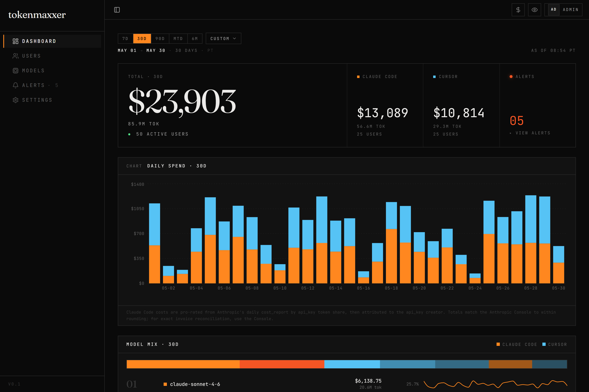
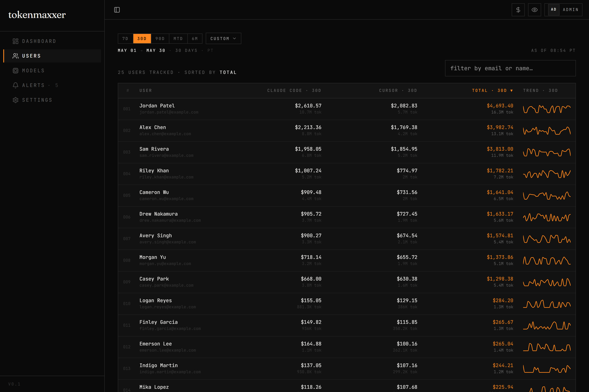
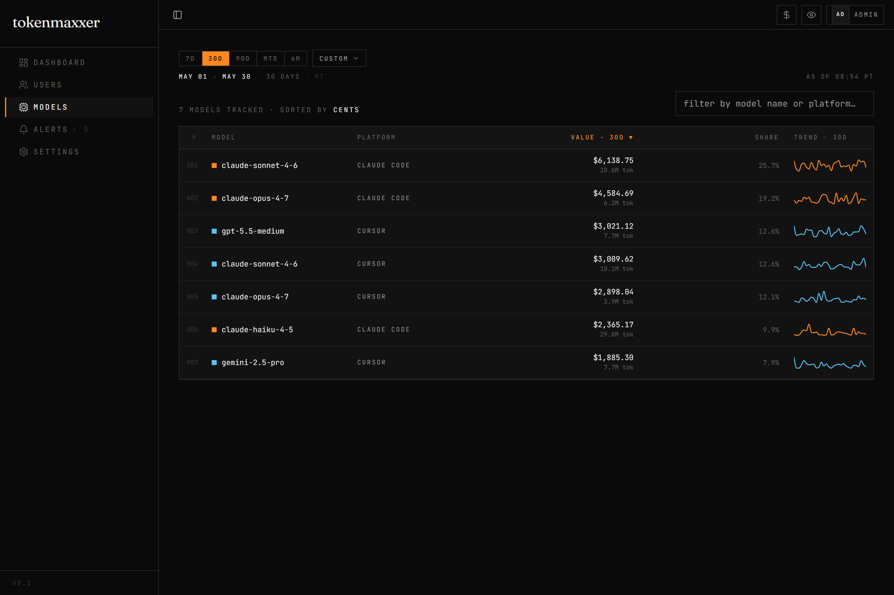
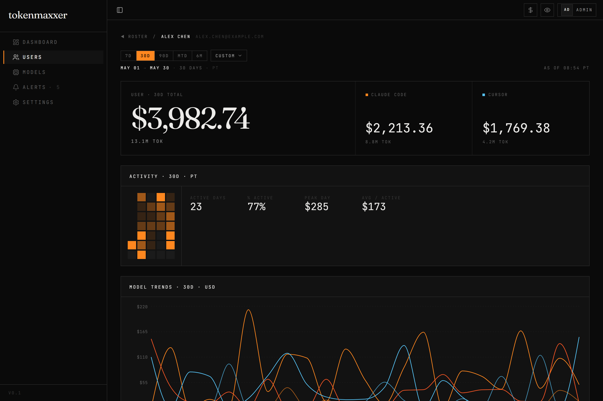
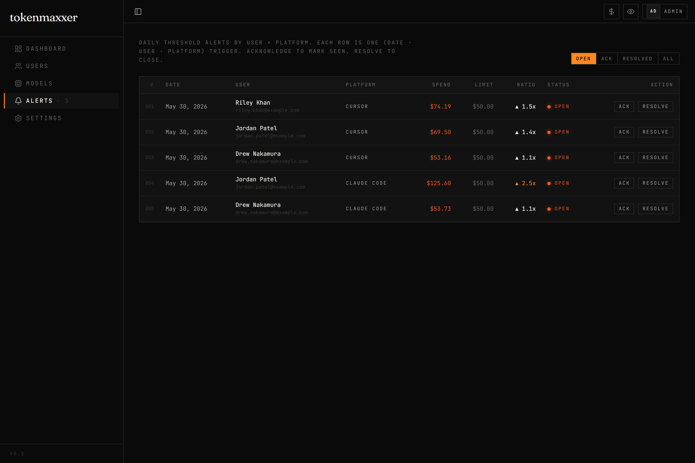

# tokenmaxxer

*If you're not burning a billion tokens a month, are you even tokenmaxxing?*

**Self-hosted AI spend dashboard for Claude Code + Cursor teams.** Pulls daily usage from Anthropic's and Cursor's admin APIs, attributes it per engineer, and tells you who's burning $200 a day before the invoice does. Threshold alerts go to Slack.



---

## Why

Your finance team gets one PDF a month. Your engineers find out at the next budget review that someone left an agent loop running over the weekend. tokenmaxxer lives in between: hourly sync, per-user attribution, daily Slack digest, dashboard you can stand up in five minutes.

If you're already paying for Claude Code (Anthropic Enterprise) and Cursor Teams and want to know who's spending what without rolling your own ETL — this is for you.

## Screenshots

| | |
|---|---|
|  |  |
| **Team** — per-engineer breakdown with sparklines | **Models** — which model is eating your budget |
|  |  |
| **User detail** — per-platform timeline and model split | **Alerts** — daily threshold breaches, posted to Slack |


## Try it in 60 seconds

```bash
git clone https://github.com/ratneshpkn/tokenmaxxer
cd tokenmaxxer
docker compose up --build
```

In a second terminal, populate the dashboard with 90 days of plausible fake data:

```bash
docker compose exec server bun run seed:demo
```

Then open <http://localhost:3003>, sign up (first user becomes admin), and skip the setup wizard. The seed creates 25 demo users at `@example.com` so you can see the dashboard, model-mix, alerts, and per-user drill-downs without ever touching a real API key.

When you're ready to connect real data, finish the setup wizard with your Anthropic admin key + Cursor admin key. The demo rows are all `@example.com`, so wiping them is a one-line `DELETE` whenever you want them gone (or `docker compose exec server bun run seed:demo -- --reset` to refresh).

## What's inside

- Hourly sync of yesterday + today from both providers, plus a daily 7-day pass to catch anything the hourly missed
- Per-engineer attribution joined by email across Anthropic and Cursor — no manual mapping
- Daily threshold alerts (global default + per-user overrides), surfaced in-app and posted to Slack as a single digest — not one DM per breach
- Two roles: admins see dollar amounts, viewers see token counts (enforced server-side)
- API keys encrypted at rest with AES-256-GCM (see [Secrets and backups](#secrets-and-backups))
- No `.env` required — every knob, including OAuth client IDs, lives in `app_config` and is editable through the UI

## One org per deployment

Each deployment is for one org. One DB, one Anthropic admin key, one Cursor admin key, one dashboard. Acme and Globex don't share an instance — they run two copies.

The first person to sign up becomes admin (atomic claim, so two parallel signups can't both win). The admin fills in API keys in the setup wizard, optionally invites teammates, done. If you want viewers for finance or random teammates without sending invites, flip `open_signup_enabled` on with an allowed email domain — anyone with a matching email self-signs-up as a viewer. Viewers see token counts; admins see dollar amounts. The cost stripping happens server-side in the route handlers, not just hidden in the UI.

No workspaces, no row-level scoping, no multi-tenant joins anywhere in the schema. If you want it for two orgs, run it twice. We figured single-org covers basically everyone paying for Claude Code + Cursor today, and the SaaS-style alternative (workspace_id on every row, scoped queries everywhere, leak risks, per-tenant billing) is its own project.

## What the numbers mean

The dashboard answers **"who is tokenmaxxing and how much are they spending?"** — not "what's our exact invoice?". Two things to know:

- **Per-engineer cost is pro-rated.** Anthropic's public admin API exposes total cost (in `cost_report`) and per-api-key tokens (in `usage_report/messages`) but never per-api-key dollars directly. We pro-rate the cost_report bucket totals across api_keys by token share within each (model, service_tier, context_window, token_type) bucket. The result matches the Anthropic Console's per-key view to within rounding.
- **Attribution is to the API key creator.** When you run `claude` in your terminal via Anthropic Enterprise SSO, your auto-provisioned key's usage shows up under your email. Shared CI keys roll up to whoever set them up. That's the best signal we have for "responsible engineer." For invoice reconciliation, use the Anthropic Console directly — that's an accounting question, not what this tool is for.

## Stack

Bun 1.x · Hono · Drizzle ORM · Postgres · React 19 · Vite 7 · Tailwind CSS v4 · wouter · shadcn/ui · Recharts · secure-headers on API routes.

## Syncs

The setup wizard pulls the first 365 days when you finish onboarding. After that, two cron jobs keep things current automatically (enabled by setting `ENABLE_CRON=true` in your environment or `.env` file):

- **Hourly** — refreshes yesterday + today from both providers. Threshold alerts fire mid-day if anyone breaches.
- **Daily at 09:00 PT** — 7-day self-heal pass, then posts the Slack digest.

If you ever need to trigger something manually:

```bash
docker compose exec server bun run sync:anthropic
docker compose exec server bun run sync:cursor
docker compose exec server bun run alerts:compute
docker compose exec server bun run slack:digest    # only if SLACK_BOT_TOKEN set
```

For ad-hoc historical pulls (e.g. after extending the team):

```bash
docker compose exec server bun run backfill --days 90
docker compose exec server bun run backfill --from 2025-01-01 --to 2025-12-31
```

## Secrets and backups

API keys (Anthropic, Cursor, Slack, Google OAuth) get encrypted before they hit Postgres. The master key is loaded via the `CONFIG_ENCRYPTION_KEY` environment variable.

- **In Production:** `CONFIG_ENCRYPTION_KEY` is strictly required (must be a 32-byte hex or base64 string). If unset, the app will throw a critical error on boot and refuse to start.
- **In Development/Testing:** If unset, the app prints a warning and falls back to an insecure development key (all zeros).

What this gets you: someone who can `pg_dump` your database but doesn't have access to your environment variables walks away with ciphertext, not your API keys.

The catch: **securely back up your `CONFIG_ENCRYPTION_KEY` value** in a password manager. Lose the key and every encrypted column in the database is permanently unrecoverable. Not joking.

## Recovery

Locked out of admin? Reset a password from the host:

```bash
docker compose exec server bun run reset-admin-password <email> <new-password>
```

## Production build, locally

Same image you'd actually deploy — baked Vite bundle, no source mount, no hot reload:

```bash
docker compose -f docker-compose.prod.yml up --build
```

The prod image (`tokenmaxxer:prod`) is what you'd tag and push to a registry:

```bash
docker build -t tokenmaxxer:latest --target prod .
docker tag tokenmaxxer:latest <account>.dkr.ecr.us-west-2.amazonaws.com/tokenmaxxer:latest
docker push <account>.dkr.ecr.us-west-2.amazonaws.com/tokenmaxxer:latest
```

## Development workflow

| Command | Purpose |
|---|---|
| `docker compose up` | Start the full stack |
| `docker compose exec server bun run seed:demo` | Populate with 90d of fake data |
| `docker compose exec server bun run db:migrate` | Apply schema changes |
| `docker compose exec server bun test` | Run tests |
| `docker compose exec server bun run check` | Type check |

Source is bind-mounted; Bun's `--hot` reloads the server on edit, Vite HMRs the client.

After adding a new dependency on the host with `bun add <pkg>`, run `docker compose exec server bun install` to sync the container's `node_modules` volume.

## Project structure

```
client/           React + Vite + shadcn/ui frontend
server/           Hono + Bun.serve + Bun.cron backend
  routes/         API route handlers
  scripts/        Sync jobs (anthropic, cursor, alerts, slack, seed-demo)
  lib/            API clients + notification service
  auth/           OAuth + password + session middleware
shared/           Drizzle schema + zod, defaults config
migrations/       drizzle-kit generated SQL (don't hand-edit; re-run `bun run db:generate`)
docs/             UI screenshots (img/)
```

## License

MIT — see [LICENSE](LICENSE).
